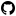

# stipple

[](https://packagist.org/packages/wazum/stipple)
[](https://packagist.org/packages/wazum/stipple)
[](https://github.com/wazum/stipple/actions/workflows/ci.yml)
[](https://phpstan.org/)
[](LICENSE)

Render small SVG icons as monochrome ANSI in the terminal — pure PHP, zero system dependencies.

Drop it into any PHP CLI tool that wants real icons next to its menu items. The output is a plain string ending in `\n` per row — works equally well with `echo`, Symfony Console, Laravel/Prompts, or whatever else writes to a TTY. Two pluggable samplers ship: Braille (default) for highest density and half-block as a more universal fallback.

## Preview

The [`actions-brand-github`](https://typo3.github.io/TYPO3.Icons/icons/actions/actions-brand-github.html) icon from [TYPO3.Icons](https://typo3.github.io/TYPO3.Icons/) (MIT-licensed) — source SVG and Braille rendering at heights 4, 6, 8:

<table>
<tr>
<td align="center" valign="middle">



<sub>Source SVG (16×16)</sub>

</td>
<td valign="top">

```
⠀⢀⣠⣤⣤⣤⣀⠀
⢠⣿⡏⠋⠙⠋⣿⣧
⠸⣿⣇⠀⠀⢀⣿⣿
⠀⠙⠿⡅⠀⣿⠟⠁
```

<sub>Braille, <code>height(4)</code></sub>

</td>
<td valign="top">

```
⠀⠀⠀⢀⣀⣀⣀⣀⣀⠀⠀⠀
⠀⢀⣴⡿⢿⣿⣿⣿⠿⣷⣄⠀
⠀⣿⣿⠇⠀⠀⠀⠀⠀⢿⣿⡇
⠀⣿⣿⡄⠀⠀⠀⠀⠀⣼⣿⡏
⠀⠹⣿⡿⠶⠀⠀⢰⣾⣿⡿⠁
⠀⠀⠈⠻⠶⠀⠀⠸⠟⠋⠀⠀
```

<sub>Braille, <code>height(6)</code></sub>

</td>
<td valign="top">

```
⠀⠀⠀⠀⠀⠀⣀⣀⣀⣀⡀⠀⠀⠀⠀⠀
⠀⠀⠀⣤⣶⣿⣿⣿⣿⣿⣿⣷⣦⡄⠀⠀
⠀⢀⣾⣿⡏⠉⠛⠛⠛⠛⠋⠉⣿⣿⣆⠀
⠀⣾⣿⣿⠋⠀⠀⠀⠀⠀⠀⠀⢻⣿⣿⡆
⠀⣿⣿⣿⡀⠀⠀⠀⠀⠀⠀⠀⣸⣿⣿⡇
⠀⠹⣿⣿⣷⣤⣀⠀⠀⢀⣀⣴⣿⣿⡿⠁
⠀⠀⠙⢿⣮⣙⣋⠀⠀⢸⣿⣿⣿⠟⠁⠀
⠀⠀⠀⠀⠉⠛⠟⠀⠀⠘⠟⠋⠁⠀⠀⠀
```

<sub>Braille, <code>height(8)</code></sub>

</td>
</tr>
</table>

Same icon at `height(8)` rendered with the half-block sampler — coarser, but works in any terminal/font:

```
   ▄▄███████▄▄
  ███▀█▀▀██▀███
 ████       ████
 ████       ████
 ▀███▄     ▄████
  ▀███▀   ████▀
    ▀▀█   ██▀
```

Every bundled example icon, rendered by stipple itself — regenerate with `php bin/generate-gallery.php`,
and see [GALLERY.md](GALLERY.md) for all heights and both samplers:

<!-- gallery:start -->

```
⠀⢀⣠⣤⣤⣤⣀⠀  ⢀⣀⡀⠀⠀⠀⠀⠀  ⠀⠀⠀⠀⠀⠀⠀⠀  ⠀⠀⠀⠀⢀⡀⠀⠀  ⠀⠀⠀⣤⢤⡄⠀⠀  ⠀⠀⢠⡤⠤⣤⠀⠀  ⢠⣤⠤⠤⠤⠤⢤⣤
⢠⣿⡏⠋⠙⠋⣿⣧  ⠀⠘⣯⠉⠉⠉⢩⡏  ⠀⢀⡴⠒⢦⠤⣄⠀  ⢀⣤⡶⠀⣾⠱⢦⣄  ⠰⣟⣙⡥⠤⣝⣉⡷  ⠀⢹⡏⣭⢩⡍⣿⠁  ⠀⠙⢧⡀⠀⣠⠟⠁
⠸⣿⣇⠀⠀⢀⣿⣿  ⠀⠀⣿⣒⣒⣒⣛⠀  ⢰⣏⠁⠀⠀⠀⠛⣦  ⠘⠷⣦⢰⡏⢠⡴⠟  ⢠⣟⠸⣧⣠⡿⠘⣧  ⠀⢸⡇⣿⢸⡇⣿⠀  ⠀⠀⢸⡇⠀⣿⠀⠀
⠀⠙⠿⡅⠀⣿⠟⠁  ⠀⠀⠻⠟⠀⠻⠟⠀  ⠀⠉⠉⠉⠉⠉⠉⠁  ⠀⠀⠈⠾⠁⠈⠀⠀  ⠀⠛⠛⣶⣰⡞⠛⠃  ⠀⠸⣇⣛⣘⣃⡿⠀  ⠀⠀⠈⠛⢶⣿⠀⠀
brand-gi    cart     cloud      code      cog      delete    filter 

⠀⣀⣀⣀⢀⣀⣀⡀  ⠀⠀⠀⢀⣀⠀⠀⠀  ⠀⠀⢀⡤⠤⣄⠀⠀  ⠀⢀⣤⠤⣤⣄⠀⠀  ⠀⠀⠀⠀⣀⠀⠀⠀  ⠀⠀⢀⣤⣤⣄⠀⠀  ⣶⣶⣶⣶⣶⣶⣶⣶
⢸⡇⠀⠈⠟⠀⠀⣿  ⠀⠀⠀⣈⣉⠀⠀⠀  ⠀⣀⣿⣀⣀⣸⣇⡀  ⢰⡟⠁⠀⠀⢹⣷⠀  ⠀⣀⣀⣼⣿⣇⣀⡀  ⠀⠀⢸⣿⣿⡿⠀⠀  ⣿⣿⣿⣿⣿⣿⣿⣿
⠀⠻⣆⠀⠀⣀⡾⠃  ⠀⠀⠀⢹⣿⠀⠀⠀  ⠀⣿⠀⣶⣶⡆⢸⡇  ⠘⢷⡀⠀⠀⣸⣏⠀  ⠀⠈⢻⣿⣿⣿⡋⠀  ⠀⠀⢀⣿⣿⣇⠀⠀  ⣿⣿⣿⣿⣿⣿⣿⣿
⠀⠀⠈⠻⠶⠋⠀⠀  ⠀⠀⠰⠾⠿⠶⠀⠀  ⠀⣿⣀⣘⣛⣀⣸⡇  ⠀⠈⠙⠛⠋⠙⢿⣷  ⠀⠀⠞⠋⠉⠛⠷⠀  ⢰⣿⣿⣿⣿⣿⣿⣷  ⣿⣿⣿⣿⣿⣿⣿⣿
 heart      info      lock     search     star      user      page  
```

<!-- gallery:end -->

## Will my icons work?

| Source | Works? |
| ------ | ------ |
| Material Icons, Material Symbols, Font Awesome, Heroicons, Bootstrap Icons, Feather, TYPO3.Icons | **Yes** — including black or unfilled icons, which is the default for most of them |
| Minified icons from a CDN (packed arc flags) | **Yes** — path data is normalised first |
| Sprite sheets (`<use>` + `<symbol>`) | **Yes** — references are inlined |
| Figma / Illustrator exports (wrapper `clip-path`, `<switch>`) | **Yes** — the no-op clip is dropped, `<switch>` unwrapped |
| Gradient- or pattern-filled icons | **Yes**, flattened to one ink colour — monochrome cannot show a gradient |
| Artwork needing real clipping or a `mask` | **No** — refused with an explanation, never rendered wrongly |
| Icons containing `<text>` | **No** — refused; convert text to paths |
| Multi-colour illustrations | Not the target. One ink colour; try `--ink=luminance` for light-on-dark art |

The rule throughout: if stipple cannot render something faithfully it raises a
`StippleException` rather than quietly emitting a blank or wrong picture.

## Install

```bash
composer require wazum/stipple
```

Requires PHP 8.2+ with `ext-gd`, `ext-mbstring`, `ext-dom`, `ext-libxml`, `ext-simplexml`. No system binaries needed — rasterization is handled in pure PHP via [`meyfa/php-svg`](https://github.com/meyfa/php-svg).

## Try it on your own icon

Installing brings a `stipple` command, so you can see one of your icons in your own terminal before
writing any code:

```bash
vendor/bin/stipple path/to/icon.svg
vendor/bin/stipple path/to/icon.svg --height=4 --sampler=half-block
vendor/bin/stipple path/to/logo.svg --color=#00ffff --ink=luminance
cat icon.svg | vendor/bin/stipple -
```

`vendor/bin/stipple --help` lists every option. It exits non-zero and writes to stderr on failure,
so it composes in a shell pipeline.

## Usage

```php
use Wazum\Stipple\Sampler\InkMode;
use Wazum\Stipple\Stipple;

// One-shot, defaults: height 8 cells, terminal default fg, Braille sampler.
echo Stipple::render('/path/to/icon.svg');
echo Stipple::renderFromString('<svg ...>');

// Fluent
echo Stipple::make('/path/to/icon.svg')
    ->height(4)                // cells; valid 1..256
    ->color('#00ffff')         // optional, 6-digit hex; null → terminal default fg
    ->accent('#ff8700')        // overrides the fallback in any var(--icon-color-accent, …) call in the SVG
    ->threshold(0.5)           // cutoff in [0.0, 1.0] for whatever the ink mode measures
    ->inkMode(InkMode::Coverage) // Coverage (default) or Luminance — see below
    ->maxRasterDimension(2048) // safety cap on the intermediate raster (default 4096 px)
    ->toString();

// __toString delegates to toString(), so casting works too:
echo (string) Stipple::make('/path/to/icon.svg')->height(4);
```

The output is a plain string ending in `\n` per row, safe to `echo` or pass to Laravel/Prompts' `note()`/`info()`.

## Laying out icons

To put an icon *beside* something — other icons, a menu label, a table column — use `toIcon()` and
get the rows unjoined:

```php
use Wazum\Stipple\RenderedIcon;

$icon = Stipple::make('/path/to/icon.svg')->height(4)->toIcon();

$icon->rows;        // list<string>, one entry per cell row, no trailing newline
$icon->widthCells;  // visible width in terminal cells
$icon->heightCells; // always equals count($icon->rows)
$icon->blankCell;   // the sampler's empty-cell glyph
$icon->row(9);      // any row; out of range yields a blank row of widthCells
$icon->blankRow();  // a full row of blank cells
echo $icon;         // same string toString() would have produced
```

**Measure rows with `widthCells`, never `strlen()`/`mb_strlen()`** — non-blank rows carry SGR escapes
and blank rows don't, so equal-width rows measure differently.

Icons side by side, the pattern `bin/icon-row.php` uses:

```php
$icons = array_map(
    static fn (string $path): RenderedIcon => Stipple::make($path)->height(4)->toIcon(),
    $paths,
);

$lineCount = max(array_map(static fn (RenderedIcon $icon): int => $icon->heightCells, $icons));

for ($line = 0; $line < $lineCount; $line++) {
    echo implode('  ', array_map(
        static fn (RenderedIcon $icon): string => $icon->row($line),
        $icons,
    )), "\n";
}
```

`row()` pads with the icon's own `blankCell` — `U+2800` for Braille, not a space — so mixed heights
and aspect ratios stay column-aligned.

## Ink mode

Monochrome output has one ink colour, so what matters is which pixels are *covered*, not what
colour they are. That is the default:

```php
use Wazum\Stipple\Sampler\InkMode;

Stipple::make($path)->toString();                          // InkMode::Coverage (default)
Stipple::make($path)->inkMode(InkMode::Luminance)->toString();
```

| Mode | A pixel is ink when | Use for |
| ---- | ------------------- | ------- |
| `Coverage` (default) | it is opaque enough — any colour | single-colour icons, including black or unfilled ones (Material, Font Awesome, Heroicons, Bootstrap) |
| `Luminance` | brightness × opacity clears the threshold | artwork that draws light shapes on a dark background, where colour carries the shape |

`threshold()` applies to whichever quantity the mode measures. Under `Coverage` it is a coverage
cutoff, so `threshold(0.0)` means "any visible pixel".

> Under `Luminance`, a black-filled or unfilled icon renders as nothing at all — black has zero
> brightness. That is why `Coverage` is the default.

## Samplers

```php
use Wazum\Stipple\Sampler\BrailleSampler;
use Wazum\Stipple\Sampler\HalfBlockSampler;

Stipple::make($path)->sampler(new BrailleSampler())->toString();   // default — 2x4 px/cell
Stipple::make($path)->sampler(new HalfBlockSampler())->toString(); // 1x2 px/cell, more universal
```

| Sampler        | Density        | Glyphs               | Best for                                      |
| -------------- | -------------- | -------------------- | --------------------------------------------- |
| `BrailleSampler` (default) | 2×4 px/cell | `U+2800`–`U+28FF` | Highest fidelity for line-art icons. Needs a Braille-capable monospace font (JetBrains Mono, Cascadia, DejaVu, Iosevka all work). |
| `HalfBlockSampler`         | 1×2 px/cell | `▀ ▄ █`           | Universal — works in any terminal/font including legacy `cmd.exe`. |

For a 16×16 SVG at `height(4)` the Braille sampler maps 1:1 with the source pixel grid; at `height(8)` it super-samples 2×.

> **Alignment note.** Blank Braille cells emit `U+2800` so adjacent icons stay column-aligned in fonts that render `U+2800` narrower than other Braille glyphs. The half-block sampler emits raw spaces for blank rows — usually fine, but two icons rendered side-by-side may drift by a column on terminals/fonts that treat space and `█` as different widths.

## Demo

Two scripts are bundled in this repository. They run only from a checkout — the `bin/`
and `examples/` directories are excluded from the Composer dist tarball, so they're not
shipped to library consumers.

```bash
composer install
php bin/demo.php      # height 4/6/8 comparison across two samplers
php bin/icon-row.php  # ten icons rendered side-by-side in a single 4-line row
```

## Pluggable rasterizer

The default rasterizer wraps `meyfa/php-svg`. You can swap in a different backend later by implementing `RasterizerInterface`:

```php
use Wazum\Stipple\Rasterizer\RasterizerInterface;

final class RsvgConvertRasterizer implements RasterizerInterface
{
    public function rasterize(string $svg, int $widthPx, int $heightPx): \GdImage { /* … */ }
}

Stipple::make($path)->rasterizer(new RsvgConvertRasterizer())->toString();
```

Custom samplers implement `SamplerInterface`; extending `AbstractSampler` gives you the shared
pixel-threshold and SGR helpers:

```php
public function sample(\GdImage $image, SamplerOptions $options): string
```

`SamplerOptions` carries the colour, threshold and ink mode, validating each on construction, so a
sampler never has to check them. `color()`/`threshold()`/`inkMode()` build it for you, or pass one
directly:

```php
use Wazum\Stipple\Sampler\SamplerOptions;

Stipple::make($path)->samplerOptions(new SamplerOptions('#00ffff', 0.4))->toString();
```

## Public API

Covered by semantic versioning: `Stipple`, `RenderedIcon`, `SamplerInterface`, `SamplerOptions`,
`InkMode`, `BrailleSampler`, `HalfBlockSampler`, `AbstractSampler`, `RasterizerInterface`,
`PhpSvgRasterizer` and the `Exception\*` hierarchy. The `stipple` command's behaviour is covered too.

`SvgPreprocessor`, `PreprocessedSvg` and `Console\StippleCommand` are marked `@internal` and may
change in any release.

## Security

The preprocessor hardens SVG input before rasterization:

- DOCTYPE / ENTITY declarations are rejected pre-parse (XXE attack surface).
- `<script>`, `<foreignObject>`, and **all `<image>`** elements are rejected after parse — embedded raster is out of scope, and allowing `<image href="file://..."/>` would let the rasterizer dependency `file_get_contents()` arbitrary local files.
- libxml is invoked with `LIBXML_NONET` (no network). The DOCTYPE check runs both before parsing
  (a raw-byte scan) and after, because the pre-scan cannot see a declaration in an encoding libxml
  auto-detects such as UTF-16.
- Path coordinates far outside the viewBox are refused. Curve and arc approximation cost scales
  with coordinate magnitude, so a tiny document could otherwise exhaust memory.
- Input files over 4 MiB are refused before being read, and control characters in a path never
  reach an exception message — a filename is attacker-controlled when a CLI walks an untrusted
  directory, and these messages get printed to a terminal.
- The host's libxml error queue is never cleared unless this library enabled collection itself.
- `Stipple::make()` accepts local filesystem paths only. Stream wrappers (`http://`, `data://`, `php://`, …) are refused, so a caller-supplied "path" cannot turn into an outbound request via the default `allow_url_fopen`. Fetch remote SVG yourself and hand it to `makeFromString()`.
- `currentColor` is substituted with a configurable foreground hex; `var(--icon-color-accent, ...)` is resolved DOM-side so the rasterizer never has to deal with CSS custom properties.

Input that cannot be handled always surfaces as a `Wazum\Stipple\Exception\StippleException`, so `catch (StippleException)` is sufficient — no raw `ValueError`/`ErrorException` leaks through.

## Supported SVG features

The preprocessor handles common patterns found in icon SVGs from any source:

- `fill="currentColor"` and `stroke="currentColor"` — substituted with `#ffffff`, since the terminal foreground is applied at output time rather than by the rasterizer.
- `style="fill: currentColor; …"` — same substitution inside inline CSS, with other declarations preserved.
- `<style>.icon { fill: currentColor }</style>` — same substitution inside a stylesheet element. Selectors are left alone and only flat declaration blocks are rewritten; declarations nested in an at-rule (`@media`) are passed through, which `meyfa/php-svg` would not resolve anyway.
- `var(--icon-color-accent, <fallback-hex>)` — resolved DOM-side using either the configured `accent()` value or the embedded fallback hex (the rasterizer doesn't resolve CSS custom properties on its own).
- `viewBox` (space- or comma-separated) for aspect-ratio resolution, or root `width`/`height`. Those may carry an absolute CSS unit (`16px`, `12pt`, `1in`, `2cm`, …) and are normalised to px, so a mismatched pair like `width="1in" height="72pt"` still resolves correctly. Relative units (`%`, `em`, `ex`) are rejected — they need a viewport this library doesn't have.
- `fill="url(#gradient)"` / `fill="url(#pattern)"` — paint-server references are flattened to solid foreground, since a gradient carries no information in monochrome and `meyfa/php-svg` would otherwise render nothing at all. An SVG 2 fallback paint after the reference wins, so `fill="url(#g) #ff8700"` uses the accent and `fill="url(#g) none"` stays invisible.
- `<use href="#id">` / `<use xlink:href="#id">` — inlined, including references to `<symbol>` and
  nested `<use>`, with `x`/`y` applied as a translate. This is how sprite-sheet icon sets are
  distributed. External references (`sprite.svg#id`) are refused rather than fetched.
- `<switch>` — replaced by its first viable child, which is what Illustrator's SVG 1.1 export wraps
  content in.
- Minified path data — arc flags written without separators (`a8 8 0 11-16 0`) and uppercase
  exponents are normalised. The rasterizer's tokeniser misreads both and silently discards the rest
  of the path, so icons from minified sets rendered as fragments.
- `clip-path` covering the whole viewBox — dropped, since it changes nothing. Figma and Illustrator
  wrap exports in exactly this.

Anything not in the above list is passed through to the rasterizer untouched.

### Not supported

These are **refused with an exception** rather than rendered incorrectly:

- **`clip-path` that actually clips**, and **`mask`** — the rasterizer ignores both, so the content
  would be drawn unclipped and an icon would silently become a filled block. Flatten first.
- **`<text>` / `<tspan>`** — no font is registered, so text would render as nothing.

These render, but not as a browser would:

- **`<style>` type selectors** (`rect { fill: … }`) are not applied by the rasterizer; class selectors are.
- **`stroke-dasharray`** renders solid.
- **`filter`** is ignored.
- **Embedded raster** (`<image>`) is rejected outright — see [Security](#security).

## Development

```bash
composer install
composer run qa          # php-cs-fixer (check) + phpstan + phpunit
composer run qa:fix      # apply php-cs-fixer
composer run golden      # compare every example icon against its recorded rendering
```

`composer run golden` is a separate suite because byte-exact rasterisation depends on the GD build
— different libgd versions place shape edges a pixel apart. The recording notes which GD produced
it and skips elsewhere, so re-record with `STIPPLE_UPDATE_GOLDEN=1 composer run golden` on your own
machine and review the diff; the pictures are stored as text. `ExampleIconsRenderTest` carries the
build-independent assertions and runs in CI.

Individually: `composer run test`, `composer run stan`, `composer run php-cs-fixer`. Levels and
paths live in `phpstan.neon` and `php-cs-fixer.config.php` rather than in the invocation.

## License

MIT — see [LICENSE](LICENSE). Bundled demo icons (`examples/icons/`) are MIT-licensed by
the [TYPO3.Icons](https://github.com/TYPO3/TYPO3.Icons) project — see
[THIRD_PARTY_NOTICES.md](THIRD_PARTY_NOTICES.md).
